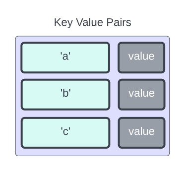

# OrderedDictionary Class

## Definition

|             |                                                          |
| ----------- | -------------------------------------------------------- |
| Namespace   | mobject-collections                                      |
| Library     | mobject-collections                                      |
| Inheritance | [Disposable](http://disposable.mobject.org/#/disposable) |
| Implements  | [I_Dictionary](I_Dictionary.md)                          |

## Remarks

The OrderedDictionary class is a data structure that is designed around the AVL Tree model. This structure allows for efficient search, insertion, and deletion operations, all of which are performed in O(log n) time. A distinctive characteristic of an AVL tree is its self-balancing nature, which ensures that the tree remains approximately balanced at all times, thereby maintaining its optimal search times.

In the OrderedDictionary class, data is stored in key-value pairs, similar to an actual dictionary. This makes it particularly useful for scenarios where fast lookup times are required for large data sets. Additionally, the implementation of the AVL tree guarantees that the operations of adding a new pair, deleting an existing pair, or updating the value of a pair are all performed quickly and efficiently. This makes the Dictionary class an invaluable tool for applications that involve frequent and dynamic changes to stored data.

The OrderedDictionary differs from the regular Dictionary as the insertion order is maintained when enumerating over keys and values. A regular dictionary stores these in alphabetical order, where as the OrderedDictionary is on insertion order.



## Example

```declaration
PROGRAM Main
VAR
	dictionary : OrderedDictionary;
	value1 : INT := 123;
	value2 : INT := 456;
	value3 : INT := 789;
	output : INT;
	allowed : BOOL;
    result : BOOL;
END_VAR
```

```body
// typical use of adding key value pairs
allowed := dictionary.TryAdd('a', value1); // allowed = true, [['a',123]]
allowed := dictionary.TryAdd('b', value2); // allowed = true, [['a',123],['b',456]]

// TryAdd will return false if the key already exists and the operation cancelled
allowed := dictionary.TryAdd('b', value3); // allowed = false, [['a',123],['b',456]]

// read key values using TryGetValue
allowed := dictionary.TryGetValue('a', output); // allowed = true, output = 123
allowed := dictionary.TryGetValue('b', output); // allowed = true, output = 456

// if a key does not exist, or the destination is the wrong size then the return shall be FALSE
allowed := dictionary.TryGetValue('c', output); // allowed = false, output = 456

// update existing key value pairs using addOrUpdate(Key,Value)
dictionary.AddOrUpdate('c', value2); // [['a',123],['b',456],['c',456]]
allowed := dictionary.TryGetValue('c', output); // allowed = true, output = 456
dictionary.AddOrUpdate('c', value3); // [['a',123],['b',456],['c',789]]
allowed := dictionary.TryGetValue('c', output); // allowed = true, output = 789

// remove key value pairs using Remove(Key)
dictionary.Remove('a'); // [['b',456],['c',789]]

// check for keys using ContainsKey
result := dictionary.ContainsKey('a'); // result = FALSE
result := dictionary.ContainsKey('b'); // result = TRUE

// clear the dictionary using Clear()
dictionary.Clear();
```

Documentation in progress...
