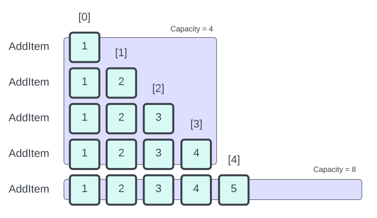
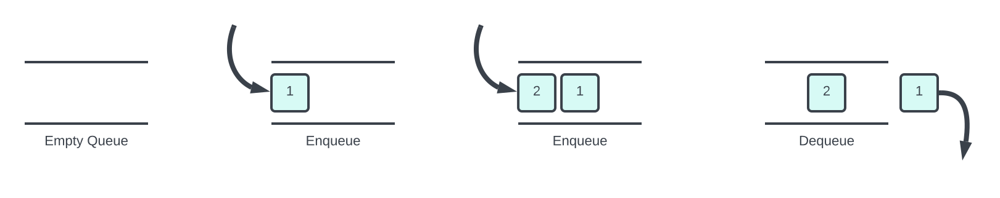
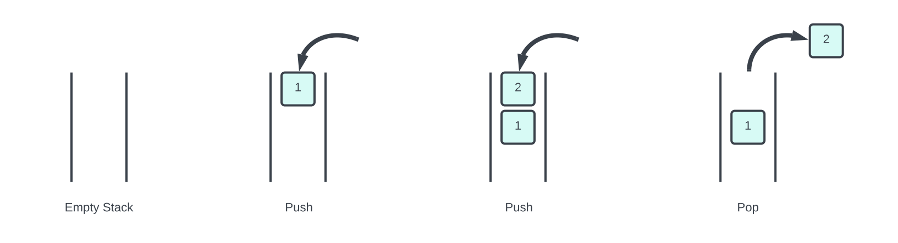

  

> A framework and guide for writing object oriented programs in structured text.

## The mobject-collections Library

This is one of the many libraries of mobject. This library focuses on dynamic collections.

## What is mobject?

Pronounced mob-ject.

A sprinkling of OOP is usually enough to simplify and unclutter procedural code. However, the more you apply OOP, the more you find the need to expand it's scope to accommodate functionality which is missing from the language. Hence, mobject was conceived. It's a framework, library and mindset of how problems such as this can be resolved using both pre-written code and examples.

mobject's goal is to be a lightweight solution to typical oop problems.

## Why use mobject-collections?

The mobject-collections library provides a set of efficient and flexible data structures that can be used to manage collections of objects in your industrial control system. The library currently includes threr classes: LinkedList Stack and Queue, with Dynamic Array and Dictionary coming soon.

### LinkedList (Double linked list)

The [LinkedList](linkedlist.md) class is a data structure that allows for efficient insertion, deletion, and traversal of items in a collection. Linked lists are particularly useful when you need to insert or delete items frequently. Additionally, linked lists can be easily be converted to static arrays.

Using the LinkedList class can help you to efficiently manage collections of objects in your industrial control system, particularly when frequent insertions and deletions are required.

The image above depicts a double linked list, which it the term given to a linked list who tracks both the head and tail. The benefit of a double linked list is that both forward and backwards traversing is possible.

### List

The [List](list.md) class is a versatile and dynamic data structure that functions as a zero-indexed, resizable array. As a general-purpose collection, it is suitable for various applications and can easily adapt to changing data sizes. The List class is part of the mobject-collections library and, like other collection classes in the library, supports enumeration through the implementation of the GetEnumerator method.

Using the List class provides an effective way to manage collections of objects in diverse scenarios, offering the advantage of dynamic resizing and easy access to elements by index. This makes it particularly useful for situations where the size of the collection is not known in advance, or when the collection is expected to grow or shrink over time.

In comparison to the LinkedList class, the List class is better suited for situations that require fast, random access to elements within the collection. However, keep in mind that insertion or deletion of items, especially at the beginning or middle of the list, may be less efficient than with a LinkedList due to the need for element shifting.

Overall, the List class is a valuable and flexible data structure that can be employed to manage collections of objects effectively, providing dynamic resizing and quick element access for a wide range of applications.

### Queue

The [Queue](queue.md) class is a data structure that follows the First-In-First-Out (FIFO) principle. Items are added to the back of the queue and removed from the front of the queue, in the order they were added. Queues are particularly useful for managing tasks that need to be processed in the order they were received, such as a set of instructions or a sequence of events.

Using the Queue class can help you to manage your system's tasks in an organized and efficient manner, ensuring that they are processed in the correct order and without any unnecessary delays.

### Stack

The [Stack](stack.md) class is a data structure that follows the Last-In-First-Out (LIFO) principle. Items are added and to the front of the stack and removed from the front of the stack also, in the order they were added. Stacks are particularly useful for managing tasks that need to be processed in the most recent order they were received, such as a set of instructions or a sequence of events.

Using the Stack class can help you to manage your system's tasks in an organized and efficient manner, ensuring that they are processed in the correct order and without any unnecessary delays.

### Dictionary

The mobject-collections library will soon be expanding to include Dictionary. Dictionaries are a data structure that allow for efficient key-value lookups.

With the addition of this class, the mobject-collections library will provide a comprehensive set of data structures that can be used to manage collections of objects in a wide range of scenarios.
