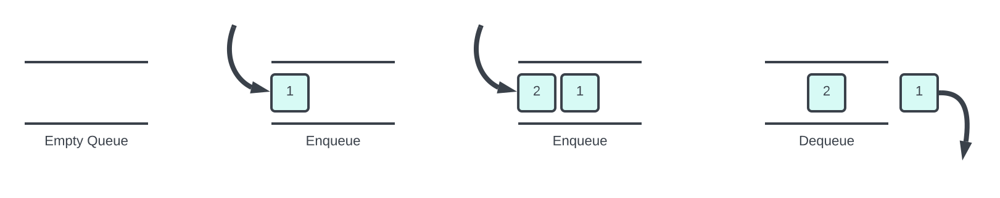

# Queue Class

## Definition

|             |                                                          |
| ----------- | -------------------------------------------------------- |
| Namespace   | mobject-collections                                      |
| Library     | mobject-collections                                      |
| Inheritance | [Disposable](http://disposable.mobject.org/#/disposable) |
| Implements  | [I_Queue](I_Queue.md)                                    |

## Remarks

The Queue Class is a general-purpose first in, first out, queue (FIFO). It supports enumerators and implements the GetEnumerator method, consistent with other collection classes in the mobject-collections library.



## Example

```declaration
PROGRAM Main
VAR
	queue : Queue;
	value1 : INT := 123;
	value2 : INT := 456;
	value3 : INT := 789;
	output : INT;
	allowed : BOOL;
END_VAR
```

```body

// using Enqueue, TryPeek and TryDequeue
// -------------------------------------

queue.Enqueue(value1); // (first->) 123
queue.Enqueue(value2); // (first->) 123, 456
queue.Enqueue(value3); // (first->) 123, 456, 789

// TryPeek will not remove the item from the queue
allowed := queue.TryPeek(output); // allowed = true, output = 123

// TryDequeue will remove the item from the queue
allowed := queue.TryDequeue(output); // allowed = true, output = 123
allowed := queue.TryDequeue(output); // allowed = true, output = 456
allowed := queue.TryDequeue(output); // allowed = true, output = 789

```

Documentation in progress...
