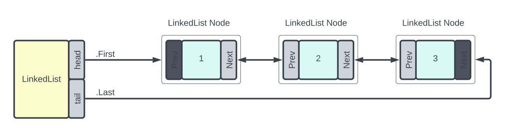

# LinkedList Class

## Definition

|             |                                                          |
| ----------- | -------------------------------------------------------- |
| Namespace   | mobject-collections                                      |
| Library     | mobject-collections                                      |
| Inheritance | [Disposable](http://disposable.mobject.org/#/disposable) |
| Implements  | [I_LinkedList](i-linkedlist.md)                          |

## Remarks

The LinkedList is a general-purpose linked list. It supports enumerators and implements the GetEnumerator method, consistent with other collection classes in the mobject-collections library.



## Example

```declaration
PROGRAM Main
VAR
	linkedList : LinkedList;
	value1 : INT := 123;
	value2 : INT := 456;
	value3 : INT := 789;
	output : INT;
	allowed : BOOL;
END_VAR
```

```body

// using AddFirst, First and RemoveFirst

linkedList.AddFirst(value1); // (first->) 123 (<-last)
linkedList.AddFirst(value2); // (first->) 456, 123 (<-last)
linkedList.AddFirst(value3); // (first->) 789, 456, 123  (<-last)

enumerator := linkedList.GetEnumerator();
// the enumerator follows the .net style, which means you must call MoveNext once to
// move to the first item.  This allows you to directly use the enumerator in a while
// loop.
WHILE enumerator.MoveNext() DO
	enumerator.TryGet(output); // 1st pass output = 789, 2nd pass output = 456, 3rd pass output = 123
END_WHILE;
// you must dispose enumerators as they are new objects.
enumerator.Dispose();

allowed := linkedList.First.TryGet(output); // allowed = true, output = 789
linkedList.RemoveFirst(); // (first->) 456, 123  (<-last)
allowed := linkedList.First.TryGet(output); // allowed = true, output = 456
linkedList.RemoveFirst(); // (first->) 123  (<-last)
allowed := linkedList.First.TryGet(output); // allowed = true, output = 123
linkedList.RemoveFirst(); // (first->) null (<-last)

```

## Methods

### AddAfter(After, Value)

Add an item to the linked list after a given node.

#### Parameters

| Parameters | Datatype                                | Description                                           |
| ---------- | --------------------------------------- | ----------------------------------------------------- |
| After      | [I_LinkedListNode](i-linkedlistnode.md) | The node object which the value will be placed after. |
| Value      | ANY                                     | The value to store in the linked list.                |

#### Return

N/A

#### Usage

```declaration
linkedList : LinkedList;
value1 : INT := 123;
value2 : INT := 456;
foundNode : I_LinkedListNode;
```

```body
linkedList.AddFirst(value1); // (first->) 123 (<-last)
foundNode := linkedList.Find(value1);
linkedList.AddAfter(foundNode,value2); // (first->) 123, 456 (<-last)
```

### AddBefore(Before, Value)

Add an item to the linked list before a given node.

#### Parameters

| Parameters | Datatype                                | Description                                            |
| ---------- | --------------------------------------- | ------------------------------------------------------ |
| Before     | [I_LinkedListNode](i-linkedlistnode.md) | The node object which the value will be placed before. |
| Value      | ANY                                     | The value to store in the linked list.                 |

#### Return

N/A

#### Usage

```declaration
linkedList : LinkedList;
value1 : INT := 123;
value2 : INT := 456;
foundNode : I_LinkedListNode;
```

```body
linkedList.AddFirst(value1); // (first->) 123 (<-last)
foundNode := linkedList.Find(value1);
linkedList.AddBefore(foundNode,value2); // (first->) 456, 123 (<-last)
```

### AddFirst(Value)

Add an item to the start of the linked list.

#### Parameters

| Parameters | Datatype | Description                            |
| ---------- | -------- | -------------------------------------- |
| Value      | ANY      | The value to store in the linked list. |

#### Return

N/A

#### Usage

```declaration
linkedList : LinkedList;
value : INT := 123;
```

```body
linkedList.AddFirst(value);
```

### AddItem(Item)

Add an item to the collection. This is a requirement of the [I_Collection](i-collection.md) interface and is the same as calling AddLast.

#### Parameters

| Parameters | Datatype | Description                          |
| ---------- | -------- | ------------------------------------ |
| Item       | ANY      | The item to store in the collection. |

#### Return

N/A

#### Usage

```declaration
linkedList : LinkedList;
value : INT := 123;
```

```body
linkedList.AddItem(value);
```

### AddLast(Value)

Add an item to the end of the linked list.

#### Parameters

| Parameters | Datatype | Description                            |
| ---------- | -------- | -------------------------------------- |
| Value      | ANY      | The value to store in the linked list. |

#### Return

N/A

#### Usage

```declaration
linkedList : LinkedList;
value : INT := 123;
```

```body
linkedList.AddLast(value);
```

### Clear()

Removes all items from the linked list.

#### Parameters

N/A

#### Return

N/A

#### Usage

```declaration
linkedList : LinkedList;
```

```body
linkedList.Clear();
```

### Contains(Item)

Checks to see if an item is contained in the list.

#### Parameters

| Parameters | Datatype | Description                    |
| ---------- | -------- | ------------------------------ |
| Item       | ANY      | The item to to check the list. |

#### Return

| Datatype | Description                                       |
| -------- | ------------------------------------------------- |
| BOOL     | Returns true if the item is contained in the list |

#### Usage

```declaration
linkedList : LinkedList;
value : INT := 123;
result : BOOL;
```

```body
linkedList.AddLast(value);
result := linkedList.Contains(value); // result = TRUE
```

### CopyTo(Destination)

Copies the contents of the linkedlist to an array. The array must be of the correct size to contain all of the items.

#### Parameters

| Parameters  | Datatype | Description                                 |
| ----------- | -------- | ------------------------------------------- |
| Destination | ANY      | The array which will act as the destination |

#### Return

| Datatype | Description                                                                                                                   |
| -------- | ----------------------------------------------------------------------------------------------------------------------------- |
| BOOL     | The method will return TRUE if the copy was completed. FALSE will be returned if the destination size is too big or too small |

#### Usage

```declaration
linkedList : LinkedList;
value1 : INT := 123;
value2 : INT := 456;
value3 : INT := 789;
myArray : ARRAY [0..2] OF INT;
```

```body
linkedList.AddLast(value1); // (first->) 123 (<-last)
linkedList.AddLast(value2); // (first->) 123, 456 (<-last)
linkedList.AddLast(value3); // (first->) 123, 456, 789 (<-last)
linkedList.CopyTo(myArray); // myArray = [123,456,789];
```

### CopyToLocation(Destination)

Copies the contents of the linkedlist to an array defined by address and size. The array must be of the correct size to contain all of the items.

#### Parameters

| Parameters         | Datatype | Description                                                |
| ------------------ | -------- | ---------------------------------------------------------- |
| DestinationAddress | PVOID    | The address of the array which will act as the destination |
| DestinationSize    | UDINT    | The size of the array which will act as the destination    |

#### Return

| Datatype | Description                                                                                                                   |
| -------- | ----------------------------------------------------------------------------------------------------------------------------- |
| BOOL     | The method will return TRUE if the copy was completed. FALSE will be returned if the destination size is too big or too small |

#### Usage

```declaration
linkedList : LinkedList;
value1 : INT := 123;
value2 : INT := 456;
value3 : INT := 789;
myArray : ARRAY [0..2] OF INT;
```

```body
linkedList.AddLast(value1); // (first->) 123 (<-last)
linkedList.AddLast(value2); // (first->) 123, 456 (<-last)
linkedList.AddLast(value3); // (first->) 123, 456, 789 (<-last)
linkedList.CopyToLocation(ADR(myArray),SIZEOF(myArray)); // myArray = [123,456,789];
```

### Dispose()

Will trigger the object for deletion.

#### Parameters

N/A

#### Return

N/A

#### Usage

```example
linkedList.Dispose()
```

### Find(Value)

Returns the first I_LinkedListNode which matches the value supplied.

#### Parameters

| Parameters | Datatype | Description             |
| ---------- | -------- | ----------------------- |
| Value      | ANY      | The value to search for |

#### Return

| Datatype                                | Description                                                                  |
| --------------------------------------- | ---------------------------------------------------------------------------- |
| [I_LinkedListNode](i-linkedlistnode.md) | The method will return the first matching node, or zero if no value is found |

#### Usage

```declaration
linkedList : LinkedList;
value1 : INT := 123;
foundNode : I_LinkedListNode;
```

```body
linkedList.AddFirst(value1); // (first->) 123 (<-last)
foundNode := linkedList.Find(value1);
```

### FindLast(Value)

Returns the last I_LinkedListNode which matches the value supplied.

#### Parameters

| Parameters | Datatype | Description             |
| ---------- | -------- | ----------------------- |
| Value      | ANY      | The value to search for |

#### Return

| Datatype                                | Description                                                                 |
| --------------------------------------- | --------------------------------------------------------------------------- |
| [I_LinkedListNode](i-linkedlistnode.md) | The method will return the last matching node, or zero if no value is found |

#### Usage

```declaration
linkedList : LinkedList;
value1 : INT := 123;
foundNode : I_LinkedListNode;
```

```body
linkedList.AddFirst(value1); // (first->) 123 (<-last)
foundNode := linkedList.FindLast(value1);
```

### GetEnumerator()

Returns a forward enumerator for the linked list. More information on the enumerators can be found [here](http://enumerable.mobject.org/#/i-forward-enumerator)

!> Enumerators are \_\_NEW objects, which means you must dispose of any enumerators you make once you are finished using them. Failure to do so will result in a memory leak.

#### Parameters

N/A

#### Return

| Datatype                                                                    | Description                                                     |
| --------------------------------------------------------------------------- | --------------------------------------------------------------- |
| [I_ForwardEnumerator](http://enumerable.mobject.org/#/i-forward-enumerator) | The method will return a forward enumerator for the linked list |

#### Usage

```declaration
linkedList : LinkedList;
value1 : INT := 123;
value2 : INT := 456;
value3 : INT := 789;
output : INT;
enumerator : I_ForwardEnumerator;
```

```body
linkedList.AddLast(value1); // (first->) 123 (<-last)
linkedList.AddLast(value2); // (first->) 123, 456 (<-last)
linkedList.AddLast(value3); // (first->) 123, 456, 789 (<-last)
enumerator := linkedList.GetEnumerator();

// the enumerator follows the .net style, which means you must call MoveNext once to
// move to the first item.  This allows you to directly use the enumerator in a while
// loop.
WHILE enumerator.MoveNext() DO
	enumerator.TryGet(output); // 1st pass output = 123, 2nd pass output = 456, 3rd pass output = 789
END_WHILE;

// you must dispose enumerators as they are new objects.
enumerator.Dispose();
```

### OnEvent(EventName, EventHandler)

Registers an event handler for the given event name. See [events](#events) for the linked list supported events.

#### Parameters

| Parameters   | Datatype                                                      | Description                    |
| ------------ | ------------------------------------------------------------- | ------------------------------ |
| EventName    | T_MAXSTRING                                                   | The name of the event.         |
| EventHandler | [I_EventHandler](http://events.mobject.org/#/i-event-handler) | The event handler to register. |

#### Return

N/A

#### Usage

```example
linkedList.OnEvent('OnChanged', eventHandler);
```

### OnceEvent(EventName, EventHandler)

Registers an event handler for the given event name which is triggered only once. See [events](#events) for the linked list supported events.

#### Parameters

| Parameters   | Datatype                                                      | Description                    |
| ------------ | ------------------------------------------------------------- | ------------------------------ |
| EventName    | T_MAXSTRING                                                   | The name of the event.         |
| EventHandler | [I_EventHandler](http://events.mobject.org/#/i-event-handler) | The event handler to register. |

#### Return

N/A

#### Usage

```example
linkedList.OnceEvent('OnChanged', eventHandler);
```

### OffEvent(EventName, EventHandler)

Unregisters an event handler for the given event name. See [events](#events) for the linked list supported events.

#### Parameters

| Parameters   | Datatype                                                      | Description                      |
| ------------ | ------------------------------------------------------------- | -------------------------------- |
| EventName    | T_MAXSTRING                                                   | The name of the event.           |
| EventHandler | [I_EventHandler](http://events.mobject.org/#/i-event-handler) | The event handler to unregister. |

#### Return

N/A

#### Usage

```example
linkedList.OffEvent('OnChanged', eventHandler);
```

### Remove(Value)

Removes the first matching value from the linked list

#### Parameters

| Parameters | Datatype | Description                                   |
| ---------- | -------- | --------------------------------------------- |
| Value      | ANY      | The value to be removed from the linked list. |

#### Return

N/A

#### Usage

```declaration
linkedList : LinkedList;
value1 : INT := 123;
value2 : INT := 456;
value3 : INT := 789;
```

```body
linkedList.AddLast(value1); // (first->) 123 (<-last)
linkedList.AddLast(value2); // (first->) 123, 456 (<-last)
linkedList.AddLast(value3); // (first->) 123, 456, 789 (<-last)
linkedList.Remove(value2); // (first->) 123, 789 (<-last)
```

### RemoveFirst()

Removes the first item from the linked list

#### Parameters

N/A

#### Return

N/A

#### Usage

```declaration
linkedList : LinkedList;
value1 : INT := 123;
value2 : INT := 456;
value3 : INT := 789;
```

```body
linkedList.AddLast(value1); // (first->) 123 (<-last)
linkedList.AddLast(value2); // (first->) 123, 456 (<-last)
linkedList.AddLast(value3); // (first->) 123, 456, 789 (<-last)
linkedList.RemoveFirst(); // (first->) 456, 789 (<-last)
```

### RemoveItem(Item)

Removes the first matching item from the linked list. This is a requirement of the [I_Collection](i-collection.md) interface and is the same as calling Remove.

#### Parameters

| Parameters | Datatype | Description                                 |
| ---------- | -------- | ------------------------------------------- |
| Item       | ANY      | The item to be removed from the collection. |

#### Return

N/A

#### Usage

```declaration
linkedList : LinkedList;
value1 : INT := 123;
value2 : INT := 456;
value3 : INT := 789;
```

```body
linkedList.AddLast(value1); // (first->) 123 (<-last)
linkedList.AddLast(value2); // (first->) 123, 456 (<-last)
linkedList.AddLast(value3); // (first->) 123, 456, 789 (<-last)
linkedList.RemoveItem(value2); // (first->) 123, 789 (<-last)
```

### RemoveLast()

Removes the last item from the linked list

#### Parameters

N/A

#### Return

N/A

#### Usage

```declaration
linkedList : LinkedList;
value1 : INT := 123;
value2 : INT := 456;
value3 : INT := 789;
```

```body
linkedList.AddLast(value1); // (first->) 123 (<-last)
linkedList.AddLast(value2); // (first->) 123, 456 (<-last)
linkedList.AddLast(value3); // (first->) 123, 456, 789 (<-last)
linkedList.RemoveLast(); // (first->) 123, 456 (<-last)
```

## Properties

### Count

Returns the total number of items held in the linked list

#### Return

| Datatype | Description                    |
| -------- | ------------------------------ |
| DINT     | Total items in the linked list |

#### Usage

```declaration
linkedList : LinkedList;
value1 : INT := 123;
value2 : INT := 456;
value3 : INT := 789;
count : DINT;
```

```body
linkedList.AddLast(value1); // (first->) 123 (<-last)
linkedList.AddLast(value2); // (first->) 123, 456 (<-last)
linkedList.AddLast(value3); // (first->) 123, 456, 789 (<-last)
count := linkedList.Count;
```

### First

Returns the first node in the linked list.

#### Return

| Datatype         | Description                       |
| ---------------- | --------------------------------- |
| I_LinkedListNode | The first node in the linked list |

#### Usage

```declaration
linkedList : LinkedList;
value1 : INT := 123;
value2 : INT := 456;
value3 : INT := 789;
output : INT;
```

```body
linkedList.AddLast(value1); // (first->) 123 (<-last)
linkedList.AddLast(value2); // (first->) 123, 456 (<-last)
linkedList.AddLast(value3); // (first->) 123, 456, 789 (<-last)
linkedList.First.TryGet(output) // output = 789
```

### Last

Returns the last node in the linked list.

#### Return

| Datatype         | Description                      |
| ---------------- | -------------------------------- |
| I_LinkedListNode | The last node in the linked list |

#### Usage

```declaration
linkedList : LinkedList;
value1 : INT := 123;
value2 : INT := 456;
value3 : INT := 789;
output : INT;
```

```body
linkedList.AddLast(value1); // (first->) 123 (<-last)
linkedList.AddLast(value2); // (first->) 123, 456 (<-last)
linkedList.AddLast(value3); // (first->) 123, 456, 789 (<-last)
linkedList.Last.TryGet(output) // output = 789
```

## Events

### OnChanged

Triggered when there is any change to the content of the linked list.

#### Return

| Datatype                                                | Description                                                   |
| ------------------------------------------------------- | ------------------------------------------------------------- |
| [I_CollectionChangedEvent](i-collectionchangedevent.md) | The event handler will be passed the I_CollectionChangedEvent |

### OnDisposed

Triggered when the linked list is disposed.

#### Return

| Datatype                                                  | Description                                                    |
| --------------------------------------------------------- | -------------------------------------------------------------- |
| [I_CollectionDisposedEvent](i-collectiondisposedevent.md) | The event handler will be passed the I_CollectionDisposedEvent |
