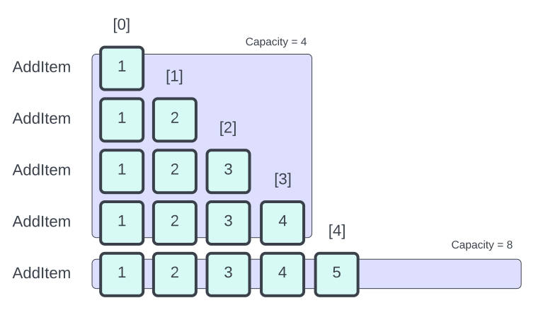

# List Class

## Definition

|             |                                                          |
| ----------- | -------------------------------------------------------- |
| Namespace   | mobject-collections                                      |
| Library     | mobject-collections                                      |
| Inheritance | [Disposable](http://disposable.mobject.org/#/disposable) |
| Implements  | [I_List](i-list.md)                                      |

## Remarks

The List is a general-purpose list which is comparable to a zero indexed dynamic array. It supports enumerators and implements the GetEnumerator method, consistent with other collection classes in the mobject-collections library.



## Example

```declaration
PROGRAM Main
VAR
	list : List;
	value1 : INT := 10;
	value2 : INT := 20;
	value3 : INT := 30;
	value4 : INT := 40;
	value5 : INT := 50;
	value6 : INT := 60;
	output : INT;
	allowed : BOOL;
END_VAR
```

```body

// example of use

// at the start the list will have a count of 0 and a capacity of 0
list.AddItem(value1); // [10,null,null,null], count = 1, capacity = 4
list.AddItem(value2); // [10,20,null,null], count = 2, capacity = 4
list.AddItem(value3); // [10,20,30,null], count = 3, capacity = 4
list.AddItem(value4); // [10,20,30,40], count = 4, capacity = 4
list.AddItem(value5); // [10,20,30,40,50,null,null,null], count = 5, capacity = 8

enumerator := list.GetEnumerator();
// the enumerator follows the .net style, which means you must call MoveNext once to
// move to the first item.  This allows you to directly use the enumerator in a while
// loop.
WHILE enumerator.MoveNext() DO
	enumerator.TryGet(output); // output results, 1st = 10, 2nd = 20, 3rd = 30, 4th = 40, 5th = 50
END_WHILE;
// you must dispose enumerators as they are new objects.
enumerator.Dispose();

// access can be via the TryGetByIndex method
allowed := list.TryGetByIndex(2, output); // allowed = true, output = 30

// access can be via the TryGetToByIndex method
allowed := list.TryGetToByIndex(3, ADR(output), SIZEOF(output)); // allowed = true, output = 40

// inserting items is possible if the index is greater than 0 and equal or less than count
list.Insert(2, value6); // [10,20,60,30,40,50,null,null], count = 6, capacity = 8

// removing items can be via index, or first found
list.RemoveAt(2); // [10,20,30,40,50,null,null,null], count = 5, capacity = 8
list.RemoveItem(value1); // [20,30,40,50,null,null,null,null], count = 4, capacity = 8

// excess memory can be returned using TrimExcess
list.TrimExcess(); // [20,30,40,50], count = 4, capacity = 4
```

## Methods

### AddItem(Item)

Add an item to the list. This is a requirement of the [I_Collection](i-collection.md) and will add the item to the end of the list.

#### Parameters

| Parameters | Datatype | Description                    |
| ---------- | -------- | ------------------------------ |
| Item       | ANY      | The item to store in the list. |

#### Return

N/A

#### Usage

```declaration
list : List;
value : INT := 123;
```

```body
list.AddItem(value);
```

### Clear()

Removes all items from the list. This does not reset the Capacity of the list.

#### Parameters

N/A

#### Return

N/A

#### Usage

```declaration
list : List;
```

```body
list.Clear();
```

### Contains(Item)

Checks to see if an item is contained in the list.

#### Parameters

| Parameters | Datatype | Description                         |
| ---------- | -------- | ----------------------------------- |
| Item       | ANY      | The item to used to check the list. |

#### Return

| Datatype | Description                                       |
| -------- | ------------------------------------------------- |
| BOOL     | Returns true if the item is contained in the list |

#### Usage

```declaration
list : List;
value : INT := 123;
result : BOOL;
```

```body
list.AddItem(value);
result := list.Contains(value); // result = TRUE
```

### CopyTo(Destination)

Copies the contents of the list to an array. The array must be of the correct size to contain all of the items.

#### Parameters

| Parameters  | Datatype | Description                                 |
| ----------- | -------- | ------------------------------------------- |
| Destination | ANY      | The array which will act as the destination |

#### Return

| Datatype | Description                                                                                                                   |
| -------- | ----------------------------------------------------------------------------------------------------------------------------- |
| BOOL     | The method will return TRUE if the copy was completed. FALSE will be returned if the destination size is too big or too small |

#### Usage

```declaration
list : List;
value1 : INT := 123;
value2 : INT := 456;
value3 : INT := 789;
myArray : ARRAY [0..2] OF INT;
```

```body
list.AddItem(value1); // [123]
list.AddItem(value2); // [123, 456]
list.AddItem(value3); // [123, 456, 789]
list.CopyTo(myArray); // myArray = [123, 456, 789];
```

### CopyToLocation(Destination)

Copies the contents of the list to an array defined by address and size. The array must be of the correct size to contain all of the items.

#### Parameters

| Parameters         | Datatype | Description                                                |
| ------------------ | -------- | ---------------------------------------------------------- |
| DestinationAddress | PVOID    | The address of the array which will act as the destination |
| DestinationSize    | UDINT    | The size of the array which will act as the destination    |

#### Return

| Datatype | Description                                                                                                                   |
| -------- | ----------------------------------------------------------------------------------------------------------------------------- |
| BOOL     | The method will return TRUE if the copy was completed. FALSE will be returned if the destination size is too big or too small |

#### Usage

```declaration
list : List;
value1 : INT := 123;
value2 : INT := 456;
value3 : INT := 789;
myArray : ARRAY [0..2] OF INT;
```

```body
list.AddItem(value1); // [123]
list.AddItem(value2); // [123, 456]
list.AddItem(value3); // [123, 456, 789]
list.CopyToLocation(ADR(myArray),SIZEOF(myArray)); // myArray = [123, 456, 789];
```

### Dispose()

Will trigger the object for deletion.

#### Parameters

N/A

#### Return

N/A

#### Usage

```example
list.Dispose()
```

### GetEnumerator()

Returns a forward enumerator for the list. More information on the enumerators can be found [here](http://enumerable.mobject.org/#/i-forward-enumerator)

!> Enumerators are \_\_NEW objects, which means you must dispose of any enumerators you make once you are finished using them. Failure to do so will result in a memory leak.

#### Parameters

N/A

#### Return

| Datatype                                                                    | Description                                                     |
| --------------------------------------------------------------------------- | --------------------------------------------------------------- |
| [I_ForwardEnumerator](http://enumerable.mobject.org/#/i-forward-enumerator) | The method will return a forward enumerator for the linked list |

#### Usage

```declaration
list : List;
value1 : INT := 123;
value2 : INT := 456;
value3 : INT := 789;
output : INT;
enumerator : I_ForwardEnumerator;
```

```body
list.AddItem(value1); // [123]
list.AddItem(value2); // [123, 456]
list.AddItem(value3); // [123, 456, 789]
enumerator := list.GetEnumerator();

// the enumerator follows the .net style, which means you must call MoveNext once to
// move to the first item.  This allows you to directly use the enumerator in a while
// loop.
WHILE enumerator.MoveNext() DO
	enumerator.TryGet(output); // 1st pass output = 123, 2nd pass output = 456, 3rd pass output = 789
END_WHILE;

// you must dispose enumerators as they are new objects.
enumerator.Dispose();
```

### OnEvent(EventName, EventHandler)

Registers an event handler for the given event name. See [events](#events) for the list supported events.

#### Parameters

| Parameters   | Datatype                                                      | Description                    |
| ------------ | ------------------------------------------------------------- | ------------------------------ |
| EventName    | T_MAXSTRING                                                   | The name of the event.         |
| EventHandler | [I_EventHandler](http://events.mobject.org/#/i-event-handler) | The event handler to register. |

#### Return

N/A

#### Usage

```example
list.OnEvent('OnChanged', eventHandler);
```

### OnceEvent(EventName, EventHandler)

Registers an event handler for the given event name which is triggered only once. See [events](#events) for the list supported events.

#### Parameters

| Parameters   | Datatype                                                      | Description                    |
| ------------ | ------------------------------------------------------------- | ------------------------------ |
| EventName    | T_MAXSTRING                                                   | The name of the event.         |
| EventHandler | [I_EventHandler](http://events.mobject.org/#/i-event-handler) | The event handler to register. |

#### Return

N/A

#### Usage

```example
list.OnceEvent('OnChanged', eventHandler);
```

### OffEvent(EventName, EventHandler)

Unregisters an event handler for the given event name. See [events](#events) for the list supported events.

#### Parameters

| Parameters   | Datatype                                                      | Description                      |
| ------------ | ------------------------------------------------------------- | -------------------------------- |
| EventName    | T_MAXSTRING                                                   | The name of the event.           |
| EventHandler | [I_EventHandler](http://events.mobject.org/#/i-event-handler) | The event handler to unregister. |

#### Return

N/A

#### Usage

```example
list.OffEvent('OnChanged', eventHandler);
```

### RemoveAt(Item)

Removes item from the list using the index. Lists are zero based index.

#### Parameters

| Parameters | Datatype | Description                                        |
| ---------- | -------- | -------------------------------------------------- |
| Index      | DINT     | The index of the item to be removed from the list. |

#### Return

| Datatype | Description                                                                                                |
| -------- | ---------------------------------------------------------------------------------------------------------- |
| BOOL     | The method will return TRUE if the remove was completed. FALSE will be returned if the index was not found |

#### Usage

```declaration
list : List;
value1 : INT := 123;
value2 : INT := 456;
value3 : INT := 789;
```

```body
list.AddItem(value1); // [123]
list.AddItem(value2); // [123, 456]
list.AddItem(value3); // [123, 456, 789]
list.RemoveAt(1); // [123, 789]
```

### RemoveItem(Item)

Removes the first matching item from the list. This is a requirement of the [I_Collection](i-collection.md) interface.

#### Parameters

| Parameters | Datatype | Description                           |
| ---------- | -------- | ------------------------------------- |
| Item       | ANY      | The item to be removed from the list. |

#### Return

N/A

#### Usage

```declaration
list : List;
value1 : INT := 123;
value2 : INT := 456;
value3 : INT := 789;
```

```body
list.AddItem(value1); // [123]
list.AddItem(value2); // [123, 456]
list.AddItem(value3); // [123, 456, 789]
list.RemoveItem(value2); // [123, 789]
```

### TrimExcess(Item)

Releases any spare capacity in the list

#### Parameters

N/A

#### Return

N/A

#### Usage

```declaration
list : List;
value1 : INT := 123;
value2 : INT := 456;
value3 : INT := 789;
```

```body
list.AddItem(value1); // [123, null, null, null], capacity = 4
list.AddItem(value2); // [123, 456, null, null], capacity = 4
list.AddItem(value3); // [123, 456, 789, null], capacity = 4
list.TrimExcess(); // [123, 456, 789], capacity = 3
```

### TryGetByIndex(Index, Destination)

Attempts to retrieve the data from the item and copy it to the destination. Only destinations of the correct size can be used.

#### Parameters

| Parameters  | Datatype | Description                                            |
| ----------- | -------- | ------------------------------------------------------ |
| Index       | DINT     | The index of the item to be removed from the list.     |
| Destination | ANY      | The variable to be used as the destination of the copy |

#### Return

| Datatype | Description                                                                                                                                                    |
| -------- | -------------------------------------------------------------------------------------------------------------------------------------------------------------- |
| BOOL     | The method will return TRUE if the copy was completed. FALSE will be returned if the index was not found or the size of the destination was the incorrect size |

#### Usage

```declaration
list : List;
value1 : INT := 123;
value2 : INT := 456;
value3 : INT := 789;
out : INT;
result : BOOL;
```

```body
list.AddItem(value1); // [123]
list.AddItem(value2); // [123, 456]
list.AddItem(value3); // [123, 456, 789]
result := list.TryGetByIndex(1, out); // result = TRUE, out = 456
```

### TryGetToByIndex(Index, Destination, DestinationSize)

Attempts to retrieve the data from the item and copy it to the destination. Only destinations of the correct size can be used.

#### Parameters

| Parameters         | Datatype | Description                                                      |
| ------------------ | -------- | ---------------------------------------------------------------- |
| Index              | DINT     | The index of the item to be removed from the list.               |
| DestinationAddress | PVOID    | The variable's address to be used as the destination of the copy |
| DestinationSize    | UDINT    | The variable's size to be used as the destination of the copy    |

#### Return

| Datatype | Description                                                                                                                                                    |
| -------- | -------------------------------------------------------------------------------------------------------------------------------------------------------------- |
| BOOL     | The method will return TRUE if the copy was completed. FALSE will be returned if the index was not found or the size of the destination was the incorrect size |

#### Usage

```declaration
list : List;
value1 : INT := 123;
value2 : INT := 456;
value3 : INT := 789;
out : INT;
result : BOOL;
```

```body
list.AddItem(value1); // [123]
list.AddItem(value2); // [123, 456]
list.AddItem(value3); // [123, 456, 789]
result := list.TryGetToByIndex(1, ADR(out), SIZEOF(out)); // result = TRUE, out = 456
```

## Properties

### Capacity

Gets or sets the total number of elements the internal data structure can hold without resizing. It is not possible to set the Capacity lower than 0, or less than the current Count.

The list will start with a capacity of 0. AddItem will automatically increase the capacity to 4. If more space is required to perform AddItem or Insert then the current capacity will be doubled.

#### GET / SET

| Datatype | Description                                                                         |
| -------- | ----------------------------------------------------------------------------------- |
| DINT     | The total number of elements the internal data structure can hold without resizing. |

#### Usage

```declaration
list : List;
value1 : INT := 123;
value2 : INT := 456;
value3 : INT := 789;
capacity : DINT;
```

```body
list.AddItem(value1); // [123, null, null, null]
list.AddItem(value2); // [123, 456, null, null]
list.AddItem(value3); // [123, 456, 789, null]
capacity := list.Capacity; // capacity = 4
```

### Count

Returns the total number of items held in the list

#### GET

| Datatype | Description             |
| -------- | ----------------------- |
| DINT     | Total items in the list |

#### Usage

```declaration
list : List;
value1 : INT := 123;
value2 : INT := 456;
value3 : INT := 789;
count : DINT;
```

```body
list.AddItem(value1); // [123, null, null, null]
list.AddItem(value2); // [123, 456, null, null]
list.AddItem(value3); // [123, 456, 789, null]
count := list.Count; // count = 3
```

## Events

### OnChanged

Triggered when there is any change to the content of the linked list.

#### Return

| Datatype                                                | Description                                                   |
| ------------------------------------------------------- | ------------------------------------------------------------- |
| [I_CollectionChangedEvent](i-collectionchangedevent.md) | The event handler will be passed the I_CollectionChangedEvent |

### OnDisposed

Triggered when the linked list is disposed.

#### Return

| Datatype                                                  | Description                                                    |
| --------------------------------------------------------- | -------------------------------------------------------------- |
| [I_CollectionDisposedEvent](i-collectiondisposedevent.md) | The event handler will be passed the I_CollectionDisposedEvent |
